AWS API Gateway
---------------
---------------

This workshop introduces you to AWS API Gateway, and how to deploy our Swagger file and wire it up to our AWS Lambdas we wrote in the previous workshop.

What is API Gateway
-------------------

> Amazon API Gateway is a fully managed service that makes it easy for developers to create, publish, maintain, monitor, and secure APIs at any scale. With a few clicks in the AWS Management Console, you can create an API that acts as a “front door” for applications to access data, business logic, or functionality from your back-end services, such as workloads running on Amazon Elastic Compute Cloud (Amazon EC2), code running on AWS Lambda, or any Web application. Amazon API Gateway handles all the tasks involved in accepting and processing up to hundreds of thousands of concurrent API calls, including traffic management, authorization and access control, monitoring, and API version management. Amazon API Gateway has no minimum fees or startup costs. You pay only for the API calls you receive and the amount of data transferred out. Source: https://aws.amazon.com/api-gateway/

So this sounds brilliant and it mentions that it is the front door to our AWS Lambda functions which is exactly what we need.

Writing our API
---------------

So login to AWS using your credentials and go to the API Gateway service.

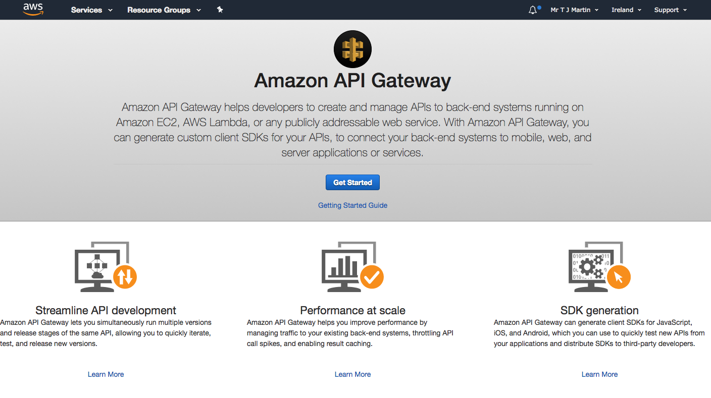

Click 'Get Started'

YOu might see the following dialogue box, if you do click OK

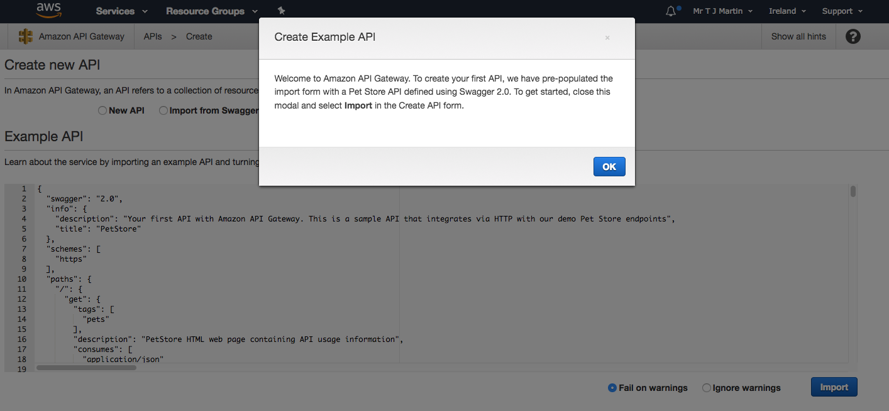

Next click 'Import from Swagger', then 'Select Swagger File' on the right hand side and then select your saved Swagger file.

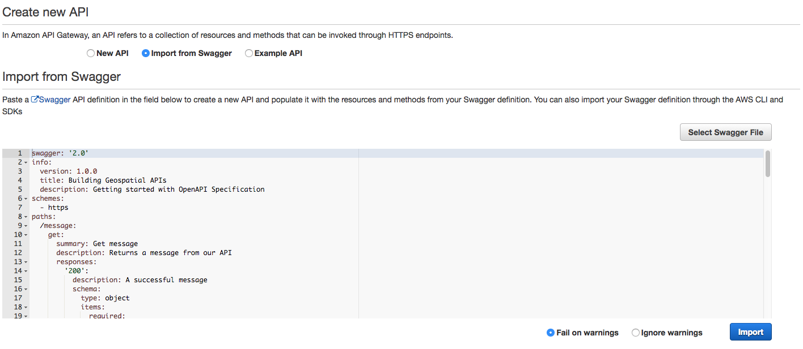

Click 'Import' 

APi Gateway will import your Swagger file and use it to setup the resources (aka paths/endpoints) and the methods for your API. So you should see the following.

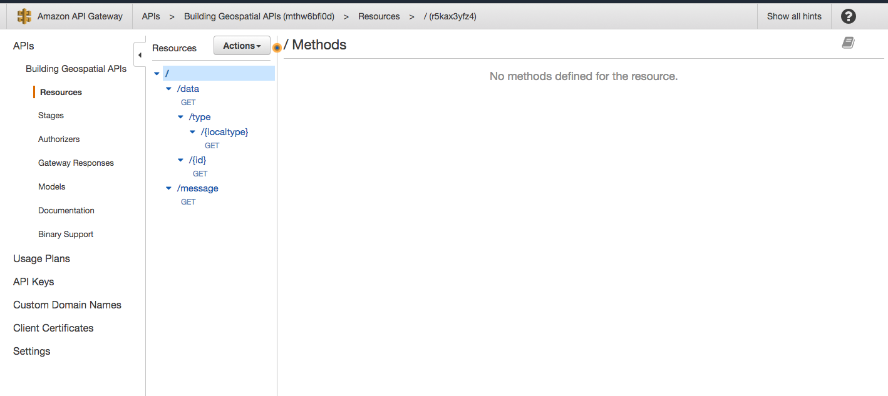

You can see the paths listed and the individual GET methods underneath each path.

Click the first GET link under /data 

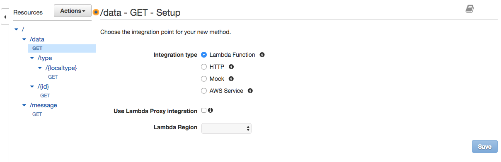

As we are going to wire this GET request to our AWS Lambda function called 'geospatialBBOX', we select 'Lambda Function', and click the tick box for 'Use Lambda Proxy Integration', then use the Lambda Region drop down to select the eu-west-1 region (or whichever region you used for your AWS Lambdas). A new input box will appear and then starting searching for our function by typing 'geospatialBBOX' and select it.

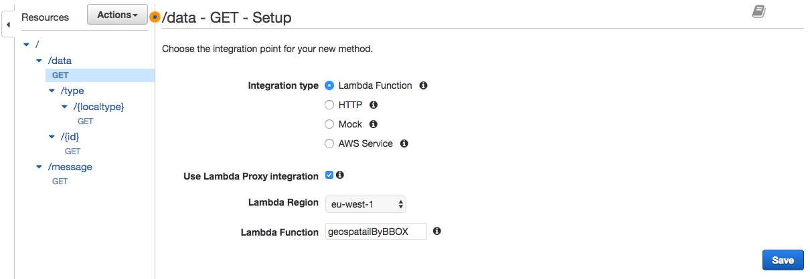

Click 'Save'

You will see the next dialogue box and click 'Ok'

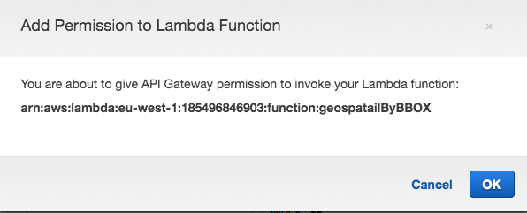

You will now see the next screen where API Gateway has joined our path GET request to our AWS Lambda function.

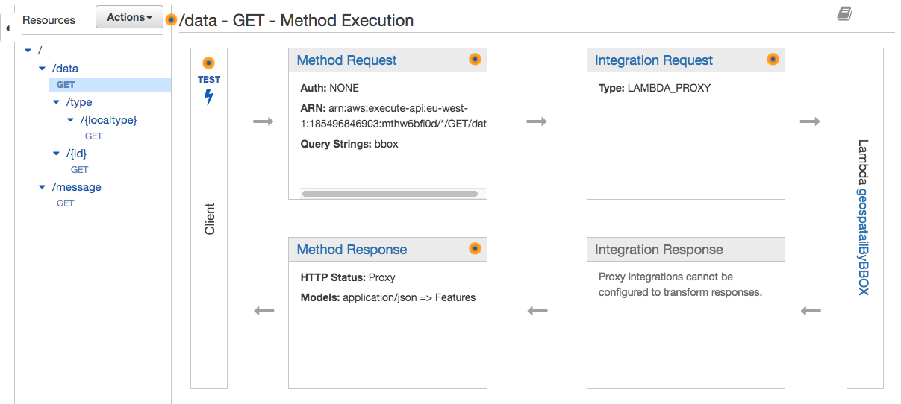

We can now test the API by clicking 'Test'

Use 'bbox=200000,200000,205000,205000' as the Query String and then click 'Test'. 

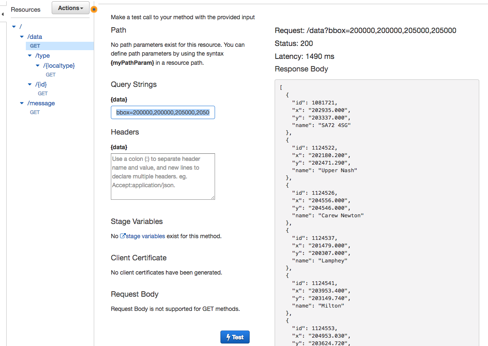

And after a few moments you will see the response body on the right hand side.

What happens if you change the Query String to 'box=200000,200000,205000,205000'?

What happens if you only provide 3 coordinates?

Hopefully you should see the error responses we wrote in our AWS Lambda function.


Next wire up the other GET methods to their matching AWS Lambda function and give them a test as you go.

The next step is to deploy our API.

Click 'Actions' at the top of our resources list and click on 'Deploy API' 

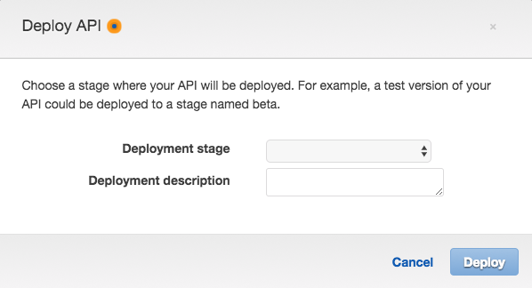

An API is deployed to a 'Stage', often there can be serveral different stages, Production, Testing and Development, however for now we will just create a stage called 'dev'

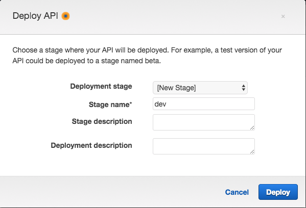

Click 'Deploy'

API Gateway has now deployed our API to the 'dev' stage and has now give us a proper URL to use for accessing the API. 

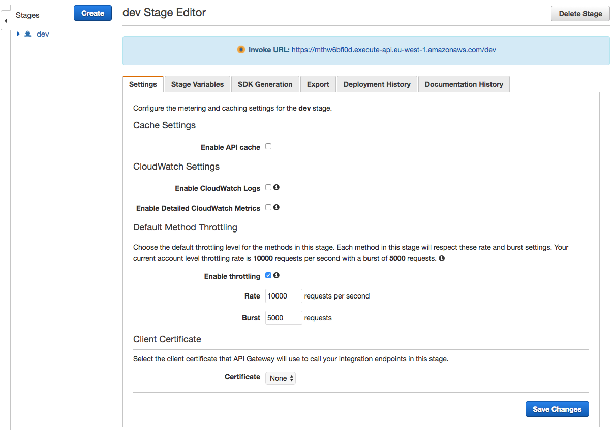

Click the 'Invoked URL' and it should open in your default browser.

You will/should get an error message of 

```
{"message":"Missing Authentication Token"}
```

This to me is a stupid error as it really does not explain that you are actually trying to access a URL that does not exist. That is because we have not added our path endpoints to the end.

So add one of our paths to the end of the URL, for example

```
https://x.execute-api.eu-west-1.amazonaws.com/dev/data/1
```

You should get the following result

```
{
  "id": 1,
  "x": "457077.000",
  "y": "1205289.000",
  "name": "Westing"
}
```


Or

```
https://x.execute-api.eu-west-1.amazonaws.com/dev/data?bbox=200000,200000,201000,201000
```

With results

```
[
  {
    "id": 1125168,
    "x": "200158.000",
    "y": "200983.000",
    "name": "SA71 5JE"
  },
  {
    "id": 1125222,
    "x": "200516.000",
    "y": "200821.000",
    "name": "SA71 5JR"
  },
  {
    "id": 1125759,
    "x": "200126.477",
    "y": "200958.418",
    "name": "Fourth Lane"
  },
  {
    "id": 1125855,
    "x": "200844.844",
    "y": "200999.664",
    "name": "Sixth Lane"
  },
  {
    "id": 1125960,
    "x": "200224.432",
    "y": "200544.263",
    "name": "Lower Lamphey Road"
  },
  {
    "id": 1125982,
    "x": "200031.000",
    "y": "200875.000",
    "name": "Crickmarren Close"
  },
  {
    "id": 1126097,
    "x": "200038.000",
    "y": "200838.000",
    "name": "SA71 5LQ"
  },
  {
    "id": 1126251,
    "x": "200430.000",
    "y": "200804.000",
    "name": "Upper Lamphey Road"
  }
]
```

HOORAY!

Now if you remember in our AWS Lambda we used the Proxy response version that looked like this

```
const responseObject = (callback, code, response) => callback(null, {
  statusCode: code,
  headers: {
        'Content-Type': 'application/json',
    },
  body: JSON.stringify(response, null, 2)
})
```

Well open the developer tools (in Chrome click the three dots in the top right, then More Tools, Developer tools) and a dialogue page on the right hand side will open up. Click 'Network' at the top 


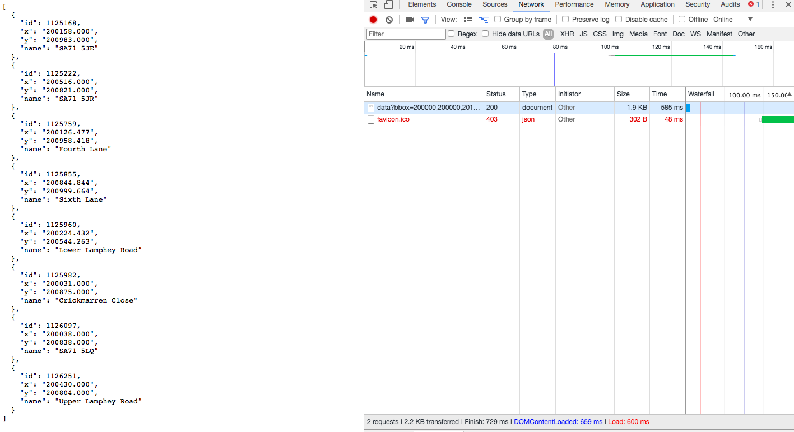

You can see our request to 'data?bbox=200000,200000,201000,201000', click on it and now you should see a page with a number of tabs (Headers, Preview, Response, Timing)

The header shows our extra information we sent as part of our response.

Status Code: 200
Content-Type: application/json 

If you change the request to 'data?bbox=200000,200000,200000,200000' and get a 'No results found' response, now look at the status code, it should be 404.


Adding an API Key
-----------------

Most APIs are protected in some way, either because the data should be restricted to certain customers or you want to charge access or you just want to protect your service from being attacked.

API Gateway allows us to setup API Keys and Usage Plans. 

We start by creating a 'Usage Plan' by click on it on the left hand side.

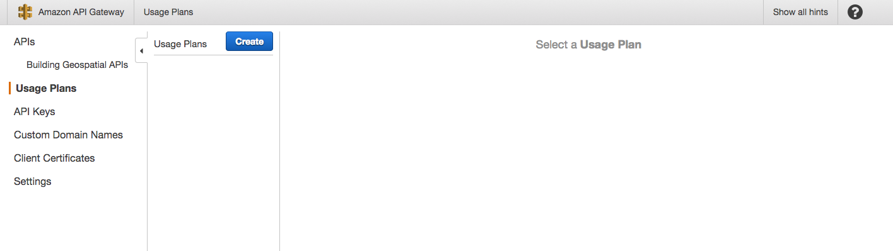

Click 'Create' and give it a name of 'Standard' and then 'Enable Throttling' with the Rate=100 and Burst=100 and Enable Quota=1000 per month.

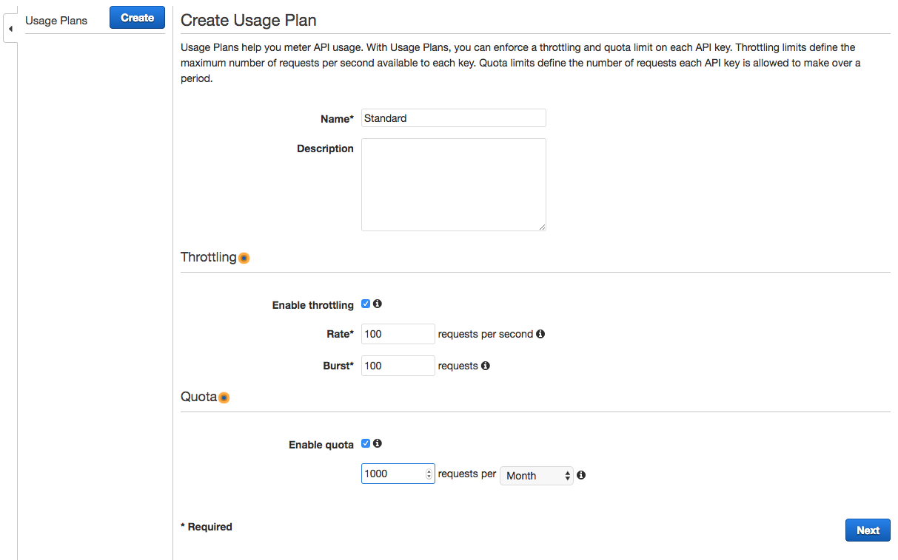

Click 'Next'

Next we need to add our API and our stage to this Usage Plan.

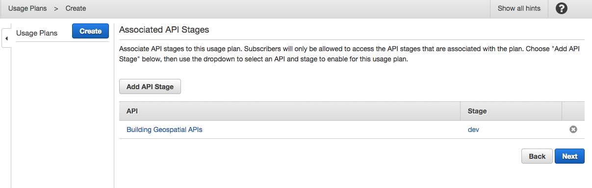

Click 'Next'

And we are asked if we want to add an existing API Key to this Plan or 'Create API Key and add to Usage Plan', so we want to click the second option.

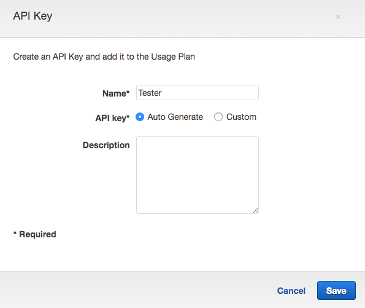

Click 'Save' 

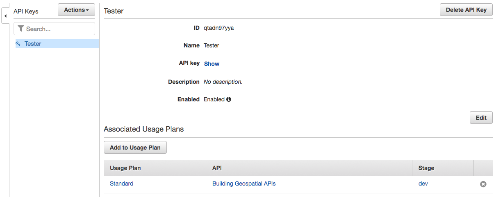

On this page you can 'Show' the API Key and save it as we will need it later for making requests. 

Now at the moment none of our resources are configured to use any form of Authorization. So click back on our API and click on the GET method.


And then click on the 'Method Request' 

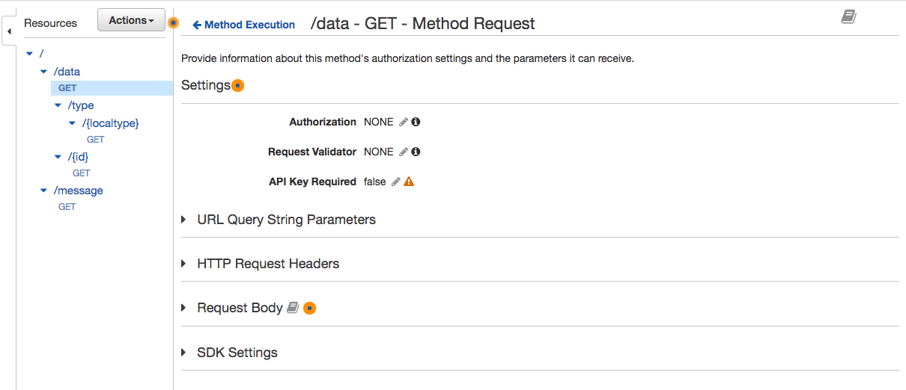

Click the pencil next to 'API Key Required: false' and use the drop down to change it to 'true' and then save the changes by clicking on the tick.

Repeat this for the other GET methods. This will make sure all requests need to be authorised.

Now try and go to the URL in your browser, can you see data?

Yes you will because we have made changes to our API without deploying those changes. So redploy the API by using 'Actions>Deploy API' and set the stage to dev as before.

Now try and make the same request and we should see the following response.

```
{"message":"Forbidden"}
```

So now our API is expecting our API Key to authorize access.

However, API Gateway uses the header x-api-key which is different to other providers who allow the API key to be a query parameter (eg daat?apikey=XXXX)

So we need to test our API using a program that allows us to provide a header API Key and for this we will use Postman.

Using Postman
-------------

Install and launch Postman.

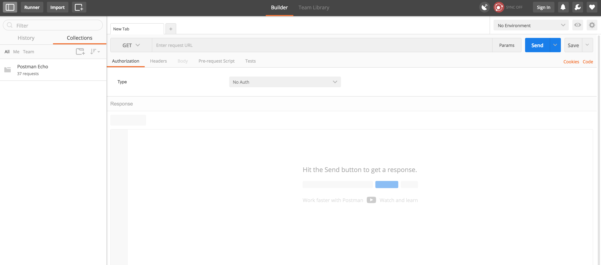

Where it says 'Enter request URL' paste in your URL 

```
https://x.execute-api.eu-west-1.amazonaws.com/dev/data?bbox=200000,200000,201000,201000
```

Make sure the method on the left is 'GET' 

Next click the 'Headers' tab and add the following

```
key: x-api-key
value: the actual API key copied from APi Gateway
```

Then click 'Send' to make a request. 

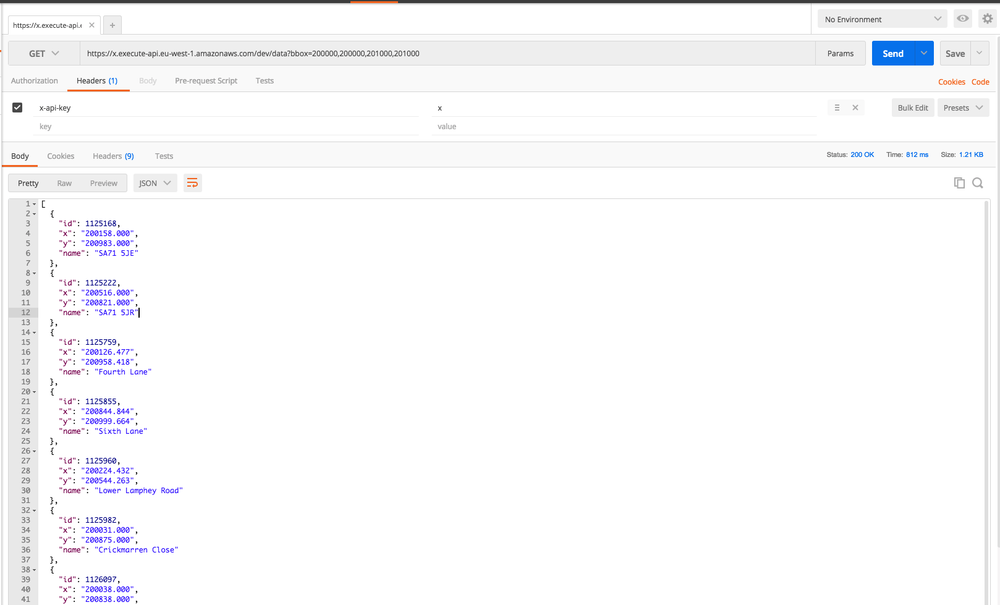

So we have now completed the workshop by successfully writing our Swagger file, writing several AWS Lambda functions and deployed an API Key protected API using API Gateway.

