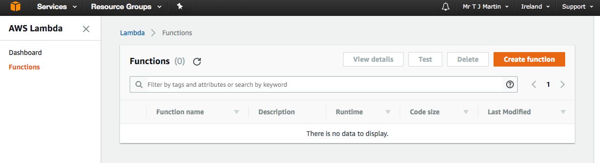
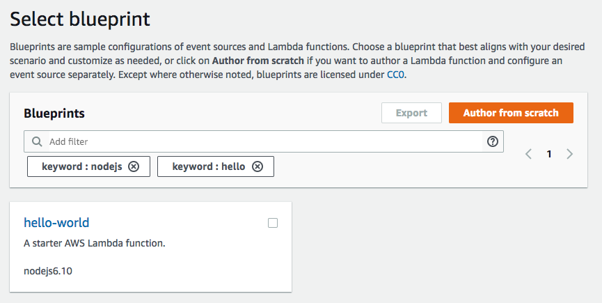
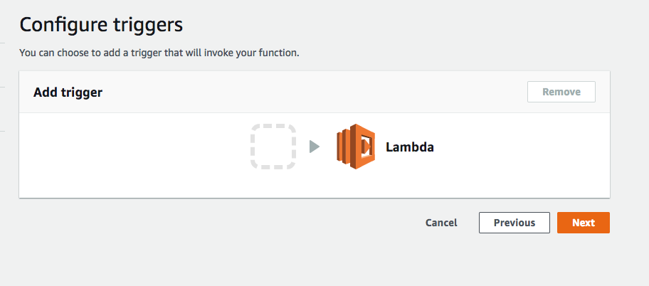
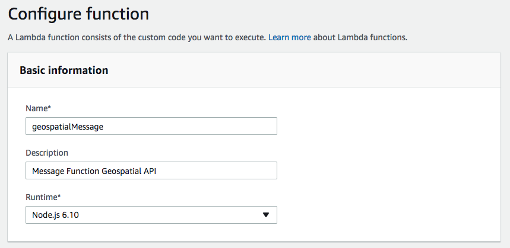
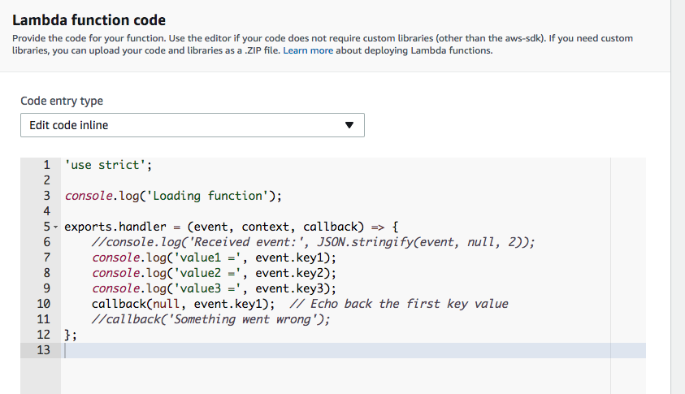
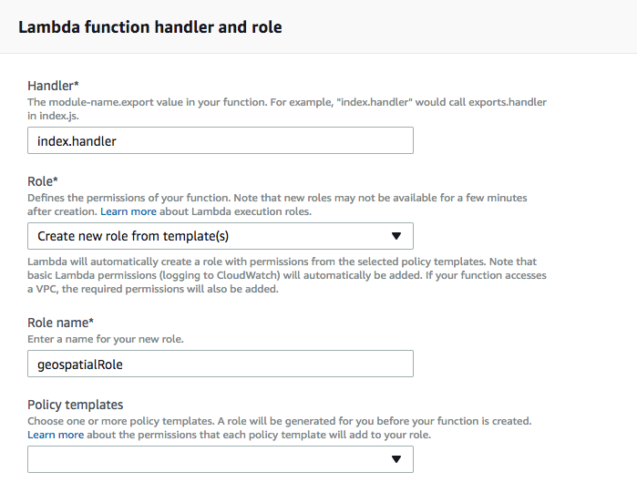
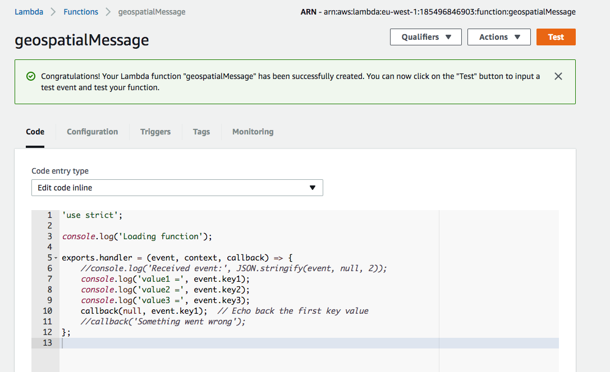
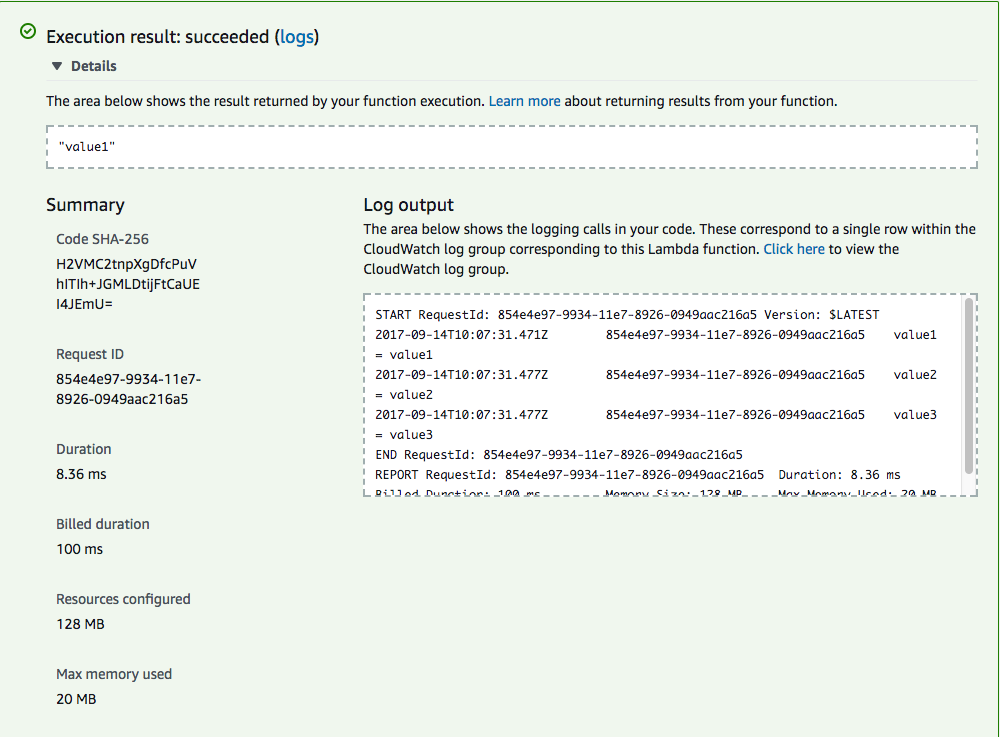
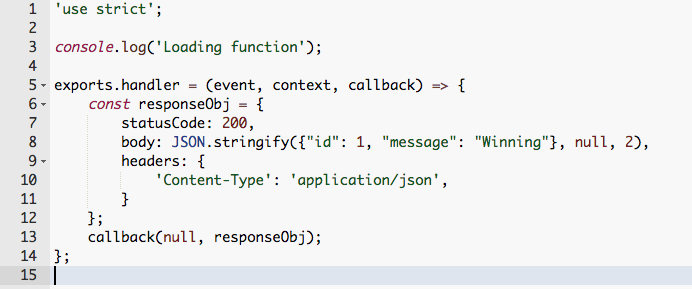
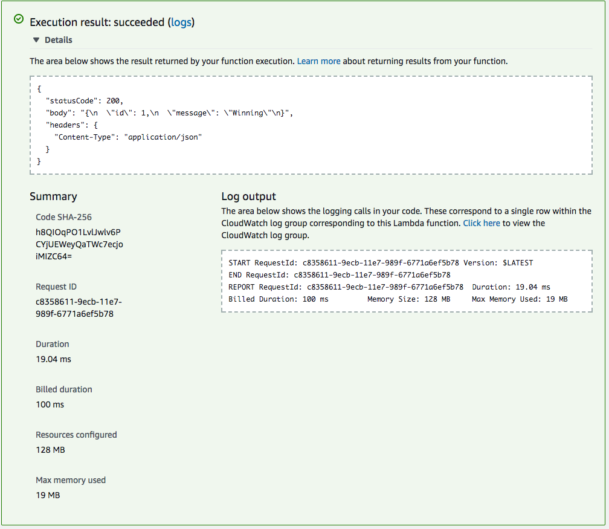

Getting Started with AWS Lambda
-------------------------------
-------------------------------

This workshop on AWS Lambda will introduce you to:
- What is AWS Lambda
- How does it work?
- Who uses it?
- Develop you first Lambdas

What is AWS Lambda?
-------------------

> AWS Lambda is a compute service that lets you run code without provisioning or managing servers. AWS Lambda executes your code only when needed and scales automatically, from a few requests per day to thousands per second. You pay only for the compute time you consume - there is no charge when your code is not running. With AWS Lambda, you can run code for virtually any type of application or backend service - all with zero administration. AWS Lambda runs your code on a high-availability compute infrastructure and performs all of the administration of the compute resources, including server and operating system maintenance, capacity provisioning and automatic scaling, code monitoring and logging. All you need to do is supply your code in one of the languages that AWS Lambda supports (currently Node.js, Java, C# and Python). Source: http://docs.aws.amazon.com/lambda/latest/dg/welcome.html

How does it work?
-----------------

> You can use AWS Lambda to run your code in response to events, such as changes to data in an Amazon S3 bucket or an Amazon DynamoDB table; to run your code in response to HTTP requests using Amazon API Gateway; or invoke your code using API calls made using AWS SDKs. Source: http://docs.aws.amazon.com/lambda/latest/dg/welcome.html

Who uses it?
------------

Difficult to know but Amazon use it for [processing imagery] (https://aws.amazon.com/blogs/compute/building-a-serverless-interface-for-global-satellite-imagery/)

- Netflix
- [AddressCloud] (http://2016.foss4g.org/talks.html#221) 

First Lambda
------------

Let us start by creating a very simple Lambda function, so start by logging into your [AWS account] (aws.amazon.com) and choose AWS Lambda from the list of services. For us we need to make sure we are in EU region (either London or Dublin).

Click 'Create Function' and search 'hello-world' to find the nodejs 6.10 hello world blueprint.

And select it.

Then on the next page do not add any triggers, so click 'Next'

Next configure the metadata of the function.

As we picked to use the hello-world blueprint it has given us some code already.

Scroll down some more and leave the 'Handler' as index.handler and we will need to 'Create new role from template(s)' and in the next input text box enter in a suitable name.

Click 'Next' and our AWS Lambda will be created.

We can now test our Lambda by clicking 'Test' in the top right hand corner and you should see the following:

The details of the test result give us a lot of information:

1. The top box shows us the result of our function
2. The summary shows us how long the function took to run, the billed duration, and the amount of memory used.
3. The log output displays any console.log message we may have added into our code, this useful for debugging our code.

Message Lambda
--------------

We will use the blueprint code as a base and edit it, so replace all the code in the inline editor with the following:

So let's walk through the code:

- responseObj - is a JSON object that contains the following keys:
    - statusCode: The status code contains an integer value that matches the response, as this is our successful response we set statusCode = 200.
    - body: The body contains our result which is this part{"id": 1, "message": "Winning}. The null, 2 tells JSON.stringify to add in 2 spaces so the JSON response is well formatted. *N.B the reason why we use JSON.stringify will be explained later. 
    - headers: This can contain any number of header key/value pairs. We have used 'Content-Type' = 'application/json' as we want to make sure that the client understands that the response it is receiving is JSON data.

- callback - Callbacks underpin nodejs code and are called when there is an error or we have finished running our function. Callbacks can be called in two ways:
    1. callback(err) - this will conclude the function sending the err back
    2. callback(null, responseObj) - as there is no error the first value is null, followed by the variable we want to send back.

Save the code and then run 'Test'

HOORAY - it works!

We can now carry on and create some more complex AWS Lambds that will use the path and query parameters can query our database and respond correctly.

