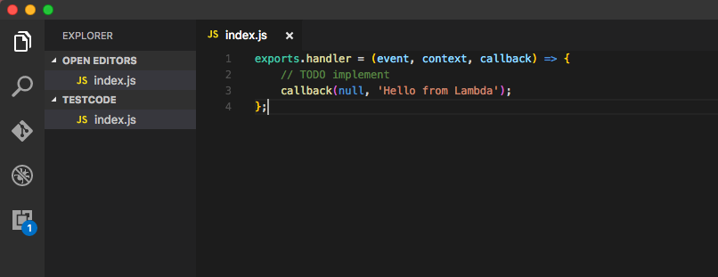
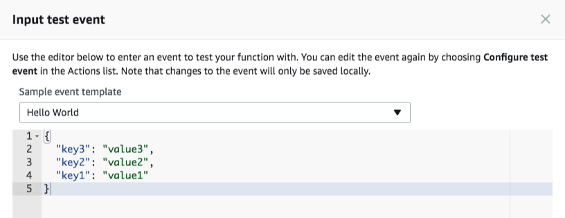
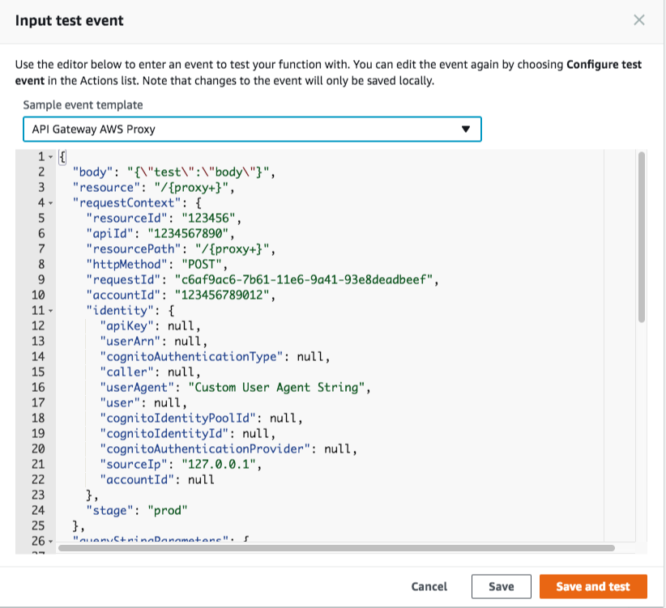
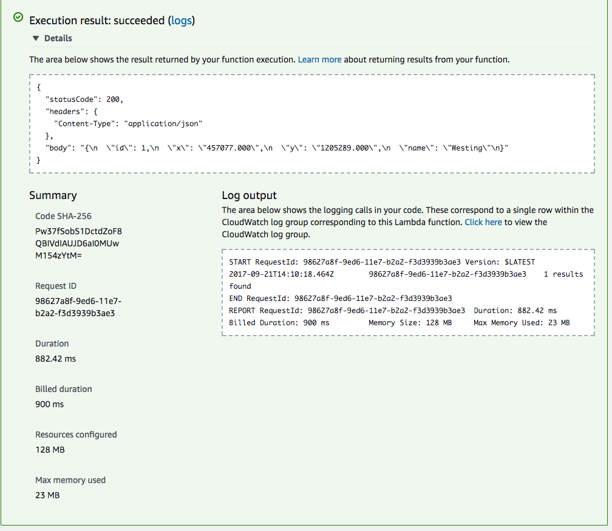
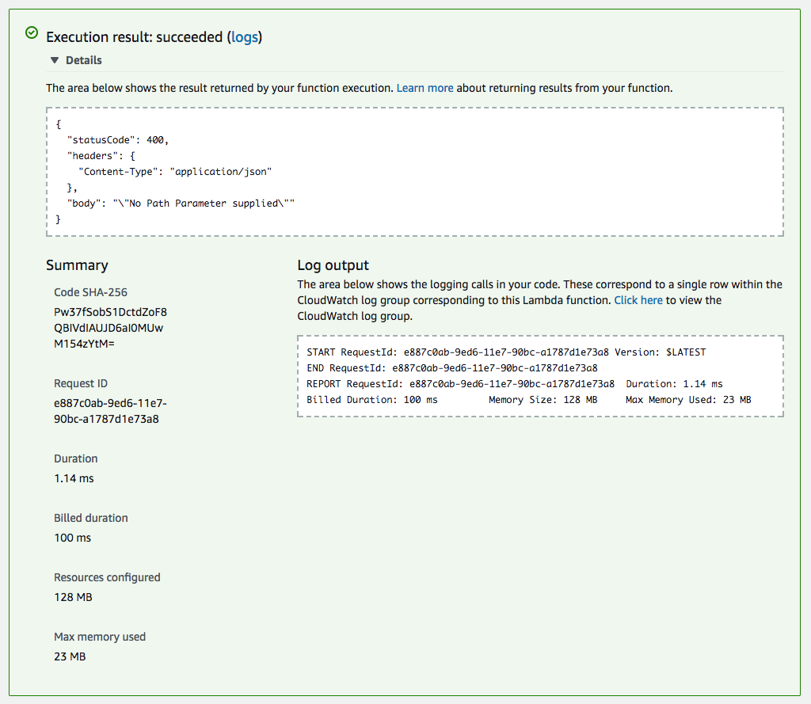
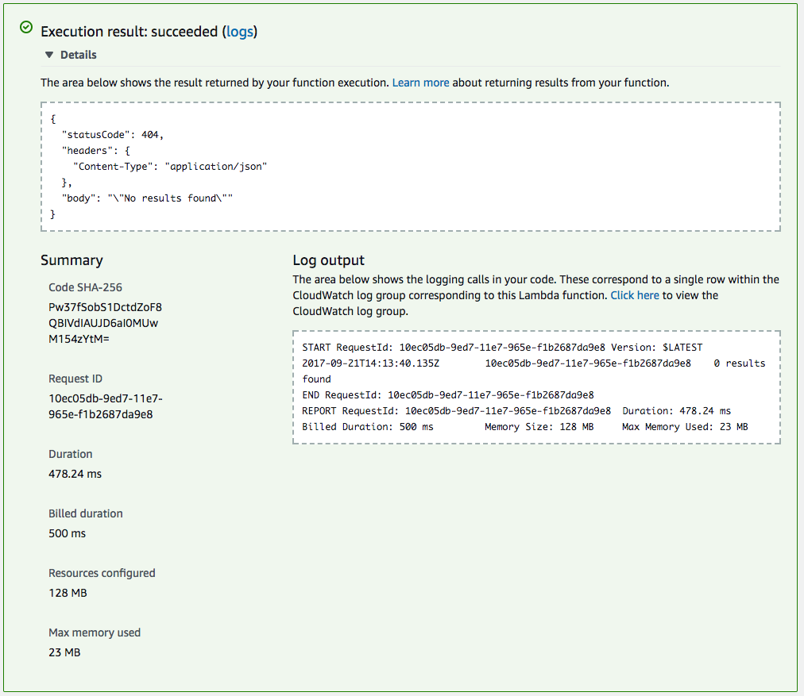

AWS Lambda: Get Data by ID
--------------------------
--------------------------

So let's start writing the code for our AWS Lambda that will respond to the /data/{id} endpoint. We will need to use the path parameter {id} to query the database.

So login to AWS and create a new blank AWS Lambda function using the 'Author from scratch' option, with no trigger. Call it 'geospatialID', and however this time reuse the role we created previously. 

As we have not used a blueprint the intial code will look like this.

```
exports.handler = (event, context, callback) => {
    // TODO implement
    callback(null, 'Hello from Lambda');
};
```

However, writing code inline is very restrictive as we cannot use any other modules or other files we may need to. So we are going to write our Lambda function locally and then upload as a zip file.

So open your favourite text editor in a folder and save a new file called index.js (index should match the name we used in the Handler when we setup the function).

Copy the code above and paste it into our index.js file.



First let us add in our responseObject that we will use to send a successful response or an error message. 

Copy the code below and add it above the `exports.handler` function

```
// Return the results in Lambda Proxy format
const responseObject = (callback, code, response) => callback(null, {
  statusCode: code,
  headers: {
        'Content-Type': 'application/json',
    },
  body: JSON.stringify(response, null, 2)
})
```

Next we are going to check to see if there is a path parameter {id} and if not send an error response.

```
// Read path
let path = event.pathParameters
if(!path) 
    return responseObject(callback, 400, 'No Path Parameter supplied')
```

The event variable contains lots but here our code is setting `path` to the event.pathParameters object and then testing if it is undefined and if it is then return using the statusCode 400 and the message of 'No Path Parameter supplied'.

Next we need to validate whether there is an id path parameter

```
 // Validate path params
let { id } = path
if (!id)
    return responseObject(callback, 400, 'id is required')
```

If the {id} parameter is undefined we again said a 400 error response.

Next we will use the {id} parameter in our SQL query and return the data accordingly.

```
// Build the query
let qs = `SELECT ogc_fid as id, geometry_x as x, geometry_y as y, name FROM open_names.names WHERE ogc_fid = ${id}`;
```

Now in order to actually query the database we are going to use one of the most popular Node modules called 'pg'. So we need to download that module and include it in our code.

Open a terminal or windows console in our folder and run the following:

```
npm install pg --save
```

This will use Node Package Manager (npm) to download the module into the node_modules folder.

Next we need to 'require' the module into our code so add the following at the very top of our index.js file.

```
const pg = require('pg');
```

Next we can use the pg module to connect to our PostGIS database and run our query. First we need to setup our database connection.

So add the following.

```
//Setup PG Client connection
const client = new pg.Client({
    user: 'postgres',
    host: 'x',
    database: 'x',
    password: 'x',
    port: 5432
});
```

Fill in the appropriate details using your own PostGIS database.

Let us now connect to the database

```
//Connect and execute the query
client.connect()
```

And then use that connection to run our query

```
client.query(qs)
    .then(result => {
        // Release the client and handle the response
        client.end()
        console.log(`${result.rows.length} results found`)
        if(result.rows.length === 0) {
            responseObject(callback, 404, 'No results found')
        } else {
        responseObject(callback, 200, result.rows[0])
        }
    })
    .catch(err => {
        console.error(err)
        responseObject(callback, 500, err)
    })
```

Here we do a client.query using our qs query. Once the query has been run we want to end the connection and then send the results back as a successful 200 response.

Because the pg module results are an array we use result.rows[0] as we expect to have a single match when using an {id} to select data from.

If there are no results we return a 404 response and if there is an error we respond with a 500.

So our full lambda should look like this

```
const pg = require('pg')

 // Return the results in Lambda Proxy format
const responseObject = (callback, code, response) => callback(null, {
  statusCode: code,
  headers: {
        'Content-Type': 'application/json',
    },
  body: JSON.stringify(response, null, 2)
})

exports.handler = (event, context, callback) => {
    //Setup PG Client connection
    const client = new pg.Client({
        user: 'postgres',
        host: 'x',
        database: 'x',
        password: 'x',
        port: 5432
    });

    // Read path
    let path = event.pathParameters
    if(!path) 
        return responseObject(callback, 400, 'No Path Parameter supplied')
        
    // Validate path params
    let { id } = path
    if (!id)
        return responseObject(callback, 400, 'id is required')

    // Build the query
    let qs = `SELECT ogc_fid as id, geometry_x as x, geometry_y as y, name FROM open_names.names WHERE ogc_fid = ${id}`;

    //Connect and execute the query
    client.connect()
    client.query(qs)
        .then(result => {
          // Release the client and handle the response
          client.end()
          console.log(`${result.rows.length} results found`)
          if(result.rows.length === 0) {
              responseObject(callback, 404, 'No results found')
          } else {
            responseObject(callback, 200, result.rows[0])
          }
        })
        .catch(err => {
            console.error(err)
            responseObject(callback, 500, err)
        })
}
```

Next we need to create a test event that will provide our Lambda function with an {id} parameter that it can use to query the data.

Click 'Action'>'Configure test event'



For the 'Sample event template' select API Gateway AWS Proxy.



Here you can see all the contents of the event variable that we have access to.

If you scroll to the bottom you will see

```
"pathParameters": {
    "proxy": "path/to/resource"
},
```

Edit it to be

```
"pathParameters": {
    "id": 1
  },
```

Then click 'Save and test' 

The function will run and hopefully give us a successful response.



You can keep editing the test event with different things to try out our function. Try removing the pathParameters object or using an ID for data that does not exist. What does the response now look like?



