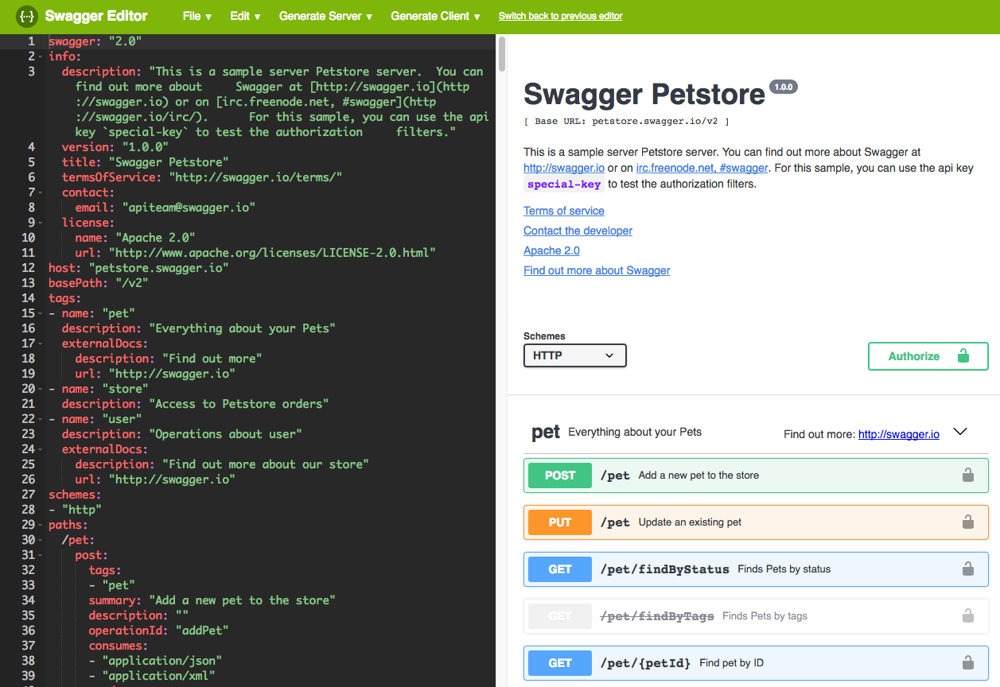
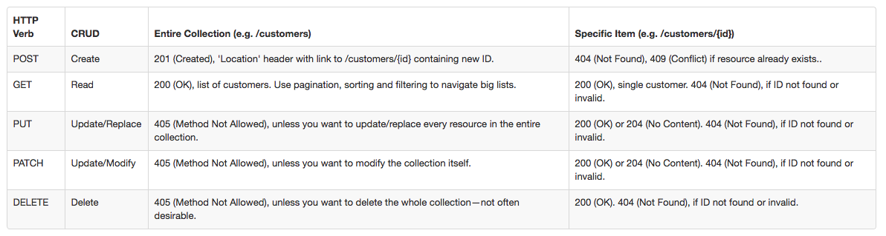

Swagger: Getting our Swagger On
-------------------------------
-------------------------------

This part of the workshop will introduce you to Swagger and we will start writing our own Swagger file that will be used with AWS API Gateway to buiild our resources and methods. It will cover
- What is Swagger? Who is involved? What are the tools?
- Swagger Editor
- What are HTTP Methods?
- What are Parameters?
- Different responses
- Using defintions

What is Swagger?
----------------

Development started in 2010 by Reverb Technologies and inn March 2015 acquired by SmartBear. In November 2015 SmartBear announced Swagger would be part of the Open API Initiative (sponsored by Linux Foundation), with Google, IBM and Microsoft all being founding members. January 2016 Swagger specification renamed as OpenAPI Specification (OAS).

> The OpenAPI Specification (OAS) defines a standard, programming language-agnostic interface description for REST APIs, which allows both humans and computers to discover and understand the capabilities of a service without requiring access to source code, additional documentation, or inspection of network traffic. When properly defined via OpenAPI, a consumer can understand and interact with the remote service with a minimal amount of implementation logic. Similar to what interface descriptions have done for lower-level programming, the OpenAPI Specification removes guesswork in calling a service. Source: Source: https://github.com/OAI/OpenAPI-Specification

Members/Users/Frameworks
------------------------

- Ebay, Adobe, Atlassian, PayPal, Salesforce, SAP, CapitalOne, Oracle, APIGEE, Elastic, Neo4J, Netflix, Postman, OpenShift, Strongloop, Visual Studio, Expedia
- Apache Maven, Angular, CKAN, Elasticsearch, Express, Flask, Grunt, MongoDB, 
- Javascript, Java, Ruby, Python, PHP, Scala, C#, Shell, Clojure, Groovy

Swagger Tools
-------------

- Swagger Editor
- Swagger Codegen
- Swagger UI

Swagger Editor
--------------

One of the best ways to get started with writing a Swagger file is using the online editor (https://editor.swagger.io). 



This is the generic Petstore example so we can start by clicking 'File>Clear Editor' and then adding the following:

```
swagger: '2.0'
info:
  version: 1.0.0
  title: Building Geospatial APIs
  description: Getting started with OpenAPI Specification
schemes:
  - http
  - https
paths: {}
```

This is the core metdata of our API. 

So we start by adding in our paths (endpoints) so remove the empty path object and write the following:

```
  /message:
    get:
      summary: Get message
      description: Returns a message from our API
      responses:
        '200':
          description: A successful message
          schema:
            type: object
            items:
              required:
                - id
                - message
              properties:
                id:
                  type: integer
                message:
                  type: string
```
This is the most basic path and contains some key parts.

- /message: the endpoint
    - get: this is the HTTP method to accept requests 
        - responses: This contains a single or more responses using the statusCode as the entry value.
            - schema: This outlines what the successful 200 response will contain. In this instance it is going to be an object with two required attributes of 'id' and 'message'.

HTTP Methods
------------

The table below shows the different types of HTTP methods.




Next we are going to create a new endpoint that will use a PATH parameter that can be used by our backend code to query our data. But what are PARAMETERS?

Parameters can be one of two types:

- path: Example: GET /users/{id} or GET /osdata/{schema}/{table}
- query: Appended to the end of the URL. Eg https://api.ordnancesurvey.co.uk/places/v1/addresses/find?query=Ordnance%20Survey,%20Adanac%20Drive,%20SO16&maxresults=1&key=YOUR_APP_KEY. Here query, maxresults and key are query parameters.

So add the following to our swagger file

```
'/data/{id}':
    get:
      summary: Get specific data feature by ID
      description: Returns single data feature
      parameters:
        - name: id
          in: path
          required: true
          description: ID of feature
          type: integer
      responses:
        '200':
          description: Successful return data
          schema:
            type: object
            required:
                - id
                - x
                - 'y'
                - name
                properties:
                id:
                    type: integer
                x:
                    type: integer
                'y':
                    type: integer
                name:
                    type: string
```

Remember that YAML works on alignment so make sure the /data/{id} is in the same column as the /message above.

Notice we have an entry of 'parameters' that defines out PATH parameter. 

To see QUERY parameters in action lets write a new path/endpoint that uses a query paramater.

```
/data:
    get:
      summary: Get all data in a BBOX
      description: Returns all data in a BBOX
      parameters:
        - name: bbox
          in: query
          required: true
          description: BBOX to filter features by
          type: string
      responses:
        '200':
          description: Successful return of data by BBOX
          schema:
            $ref: '#/definitions/Features'
```

Notice that the parameter object 'in' now says 'query' rather than 'path' like we had for {id}.

We have also added a new concept of 'definitions'

Reusable Defintions
-------------------

Definitions allow us to write a single schema and reuse that schema in any number of paths rather than rewriting the schema out time and time again.

So at the very bottom of your file paste in the following:

```
definitions:
  Features:
    required:
      - feature
    properties:
      feature:
        $ref: '#/definitions/Feature'
  Feature:
    required:
      - id
      - x
      - 'y'
      - name
    properties:
      id:
        type: integer
      x:
        type: integer
      'y':
        type: integer
      name:
        type: string
```

Here we create two 'defintions'

1. Features: this is an array containing 'feature' which references the feature definitions
2. Feature: this is a single feature and contains our required items.

So now that we have our defintions we can replace the schema entries with these.

So we can edit our /data/{id} path to look like this:

```
'/data/{id}':
    get:
      summary: Get specific data feature by ID
      description: Returns single data feature
      parameters:
        - name: id
          in: path
          required: true
          description: ID of feature
          type: integer
      responses:
        '200':
          description: Successful return data
          schema:
            $ref: '#/definitions/Feature'
```

See that we reference the Feature definition as we expect just a single feature to be responded by that query, whilst the schema in the /data path points to the Features definition as we will expect a number of results (array).

Finally let's add a path that uses both a PATH and QUERY parameters.

```
/data/type/{localtype}:
    get:
      summary: stuff
      parameters:
        - name: localtype
          in: path
          required: true
          type: string
        - name: limit
          in: query
          required: false
          type: integer
          maximum: 100
          minimum: 1
        - name: page
          in: query
          type: integer
          required: false
      responses:
        '200':
          description: Successful data filtered by local type
          schema:
            $ref: '#/definitions/Features'
```

So we now have a PATH parameter of {localtype} and two QUERY parameters of LIMIT and PAGE, and we reference our Features definition.

Once we have finished writing our swagger file we can download the YAML or JSON version from the online editor using 'File>Download xxx'


